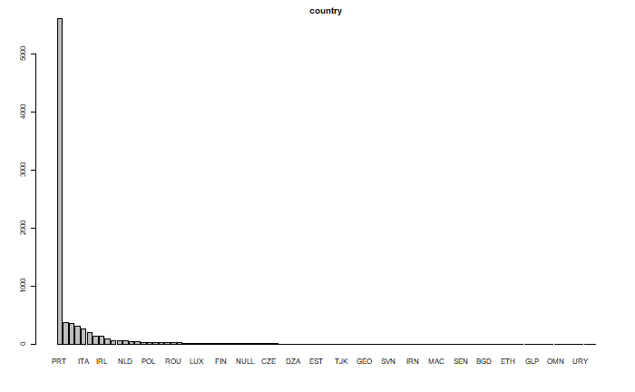

--- 
title: "Proyecto Final: Hotel Cancelation"
author: "Alex Joel Marco"
date: "`r Sys.Date()`"
site: bookdown::bookdown_site
documentclass: book
bibliography: [book.bib, packages.bib]
biblio-style: apalike
link-citations: yes
description: "Este es el reporte final del proyecto final sobre el concurso de Kaggle de predicción de cancelación en hoteles."
---


```{r setup, include=FALSE}
knitr::opts_chunk$set(echo = TRUE)
```
 
# Introducción 

## Proyecto

+ Cancelaciones en Hoteles
+ Predecir cancelación de reservas en hoteles - AM 2021

## Descripción del problema

Con el fin de planear tarifas y actividades de ventas o promoción, los hoteles hacen estimaciones adelantadas de su ocupación en cada día. Una parte de estas estimaciones requiere predecir cuántas de las reservaciones que ya se tienen van a terminar en cancelaciones, lo cual libera inventario que afecta en la planeación.

## Objetivo

Predecir cuáles reservaciones son probables que terminen o no en cancelación.

## Fuente de datos

Los datos que se utilizaron para este proyecto fueron obtenidos del sitio [Kaggle](https://www.kaggle.com/c/cancelaciones-en-hoteles/data).


Los datos originales provienen de [Hotel](https://www.sciencedirect.com/science/article/pii/S2352340918315191) booking demand datasets, Antonio, de Almeida, Nunes. 

## Ambiente
```{r, include = FALSE}
library('bookdown')
```


```{r, echo=TRUE, include = FALSE}
########## IMPORTACION LIBRERIAS #########

library(tidyverse)
library(Hmisc)
library(skimr)
library(naniar)
library(patchwork)
library(plotly)
library(ggplot2)
library(DataExplorer)
library(knitr)
library(reshape2)
library(PerformanceAnalytics)
library(corrplot)
library(cowplot) 
library(lubridate)

library(dplyr)
library(stargazer)
library(stringr)
library(Matrix)
library(gamlr)
library(Matrix.utils)

######## CARGA DE DATOS ###########

data<-read.csv("data/entrena.csv",stringsAsFactors = F)

idx <- sample(seq(1, 3), size = nrow(data), replace = TRUE, prob = c(.7, 2, .1))
train <- data[idx == 1,]
test <- data[idx == 2,]
cal <- data[idx == 3,]

```


# Análisis Exploratorio de Datos


Con el fin de entender los datos realizamos una revisión general de estos (solamente de la base de datos de entrenamiento posterior a haberla dividido en entrenamiento, validación y prueba) y tratamos de identificar aquellas variables que pudieran ser interesantes para nuestro estudio. A continuación se muestra una breve parte de la exploración de datos. Si desea consultar el análisis completo puede encontrarlo en la siguiente liga [EDA](https://github.com/marcoyel21/hotel_cancelation_ML21/blob/main/final/EDA_Cancelaciones.Rmd).

El data set está compuesto por las siguientes variables:

|	Variable	|	Tipo	|	Descripción	|
|:---:|:---:|:---:|
|	ADR	|	Numeric	|	Tarifa diaria promedio definida por [5]	|
|	Adults	|	Integer	|	Número de Adultos	|
|	Agent	|	Categorical	|	DNI de la agencia de viajes que realizó la reservaa	|
|	ArrivalDateDayOfMonth	|	Integer	|	Día del mes de la fecha de llegada	|
|	ArrivalDateMonth	|	Categorical	|	Mes de la fecha de llegada con 12 categorías: "enero" a "diciembre"	|
|	ArrivalDateWeekNumber	|	Integer	|	Número de semana de la fecha de llegada	|
|	ArrivalDateYear	|	Integer	|	Año de la fecha de llegada	|
|	AssignedRoomType	|	Categorical	|	Código del tipo de habitación asignada a la reserva. A veces, el tipo de habitación asignada difiere del tipo de habitación reservada debido a razones de operación del hotel (por ejemplo, overbooking) o por solicitud del cliente. El código se presenta en lugar de la designación por razones de anonimato	|
|	Babies	|	Integer	|	Numero de bebes	|
|	BookingChanges	|	Integer	|	Número de cambios / modificaciones realizadas a la reserva desde el momento en que se ingresó la reserva en el PMS hasta el momento del check-in o la cancelación	|
|	Children	|	Integer	|	Numero de niños	|
|	Company	|	Categorical	|	DNI de la empresa / entidad que realizó la reserva o responsable del pago de la reserva. La identificación se presenta en lugar de la designación por razones de anonimato	|
|	Country	|	Categorical	|	País de origen. Las categorías están representadas en el formato ISO 3155-3: 2013 [6]	|
|	CustomerType	|	Categorical	|	Tipo de reserva, asumiendo una de cuatro categorías:	|
|	DaysInWaitingList	|	Integer	|	Número de días que la reserva estuvo en lista de espera antes de que fuera confirmada al cliente	|
|	DepositType	|	Categorical	|	Indicación sobre si el cliente realizó un depósito para garantizar la reserva. Esta variable puede asumir tres categorías:	|
|	DistributionChannel	|	Categorical	|	Canal de distribución de reservas. El término "TA" significa "Agentes de viajes" y "TO" significa "Operadores turísticos"	|
|	**IsCanceled**	|	**Categorical**	|	**Valor que indica si la reserva fue cancelada (1) o no (0)**	|
|	IsRepeatedGuest	|	Categorical	|	Valor que indica si el nombre de la reserva fue de un huésped repetido (1) o no (0)	|
|	LeadTime	|	Integer	|	Número de días transcurridos entre la fecha de entrada de la reserva en el PMS y la fecha de llegada	|
|	MarketSegment	|	Categorical	|	Designación de segmento de mercado. En las categorías, el término "TA" significa "Agentes de viajes" y "TO" significa "Operadores turísticos"	|
|	Meal	|	Categorical	|	Tipo de comida reservada. Las categorías se presentan en paquetes de comidas de hospitalidad estándar:	|
|	PreviousBookingsNotCanceled	|	Integer	|	Número de reservas anteriores no canceladas por el cliente antes de la reserva actual	|
|	PreviousCancellations	|	Integer	|	Número de reservas anteriores que fueron canceladas por el cliente antes de la reserva actual	|
|	RequiredCardParkingSpaces	|	Integer	|	Número de plazas de aparcamiento requeridas por el cliente	|
|	ReservationStatus	|	Categorical	|	Último estado de la reserva, asumiendo una de tres categorías:	|
|	ReservationStatusDate	|	Date	|	Fecha en la que se estableció el último estado. Esta variable se puede utilizar junto con ReservationStatus para comprender cuándo se canceló la reserva o cuándo se registró el cliente en el hotel.	|
|	ReservedRoomType	|	Categorical	|	Código del tipo de habitación reservado. El código se presenta en lugar de la designación por razones de anonimato	|
|	StaysInWeekendNights	|	Integer	|	Número de noches de fin de semana (sábado o domingo) que el huésped se hospedó o reservó para alojarse en el hotel	|
|	StaysInWeekNights	|	Integer	|	Número de noches de la semana (de lunes a viernes) que el huésped se hospedó o reservó para alojarse en el hotel	|
|	TotalOfSpecialRequests	|	Integer	|	Número de solicitudes especiales realizadas por el cliente (por ejemplo, dos camas individuales o piso alto)	|

```{r, include = FALSE}

a <- table(train$is_canceled)
prop <- prop.table(a)
prop
```

Nuestra variable de interés es **IsCanceled** la cual toma valores de 1 (fue cancelada) y 0 (no fue cancelada). Así que primero veamos la proporción de cancelaciones en los datos. 

|Cancelado| No cancelado|
|:---:|:---:|
|0.3620854| 0.6379146 |

Usamos la función skim en la base de datos de entrenamiento para conocer las características generales de cada variable.

```{r, message = FALSE, echo=FALSE}
skim(data)
```

Podemos observar que:

* Tenemos 13 variables categorías, de las cuales podemos destacar que 3 tienen un número alto de categorías (country, agent, company).

* Tenemos 17 variables numéricas. 

* En este primer acercamiento, podemos identificar que las variables corresponden a: 
  - Variables de tiempo: tiempo previo de reservación, fechas de llegada, duración de la reservación.

  - Características de reservación: agencia, país, canal de distribución, segmento de mercado, tipo de depósito, tarifa diaria

  - Características de los clientes y sus preferencias: adultos, bebes, tipo de hotel, tipo de habitación

### Cancelaciones EDA

Ahora extraemos el subconjunto de cancelados para hacer una revisión de todas las variables con respecto a las reservaciónes canceladas.

```{r}
sub_cancelados <- subset(train, is_canceled == "cancelado")
```

Iniciamos con la revisión de los histogramas de cada variable para ver si podemos identificar algun compartamiento interesante. A continuación se muestran los histogramas de las variables más interesantes a nuestro criterio, nuevamente puede consultar la exploración completa de los datos en [EDA](https://github.com/marcoyel21/hotel_cancelation_ML21/blob/main/final/EDA_Cancelaciones.Rmd).


**Lead_time:** la distribución de sus datos no tiene un comportamiento lógico, porque el mayor número de cancelaciones proviene de o días previos de reservación, pero luego se mueve a valores de 90 días, 40 días y luego regresa a 2 días. será importante ver si existe algún patrón en esta variable.

```{r, echo=FALSE, fig.align='center'}

hist1<- ggplot(sub_cancelados, aes(x = lead_time)) + geom_bar() + stat_bin(bins = 40, color  = 'blue', fill="lightblue") + ggtitle("Reservaciones canceladas" ) +
  xlab("Lead time") + ylab("Count")# + ylim(0, 500)
# + geom_density(alpha=0.6)

hist2 <- ggplot(train, aes(x = lead_time)) + geom_bar() + stat_bin(bins = 40, color  = 'blue', fill="lightblue") + ggtitle("Datos Training" ) +
  xlab("Lead time") + ylab("Count")
  

plot_grid(hist1, hist2 , 
          labels = c("A", "B"),
          ncol = 2, nrow = 1)
```

Si observamos la variable Lead_time antes de la extracción de los datos de cancelación vemos solamente que existe un sesgo, sin embargo, al graficar la misma variable seleccionando solo donde se hicieron cancelaciones podemos ver más claramente la distribución y los picos que son interesantes para nuestro análisis 

**Country:** esta variable presenta un dato totalmente atípico en la categoría PRT por lo que es importante considerarla ya que podría explicar una porción importante de las cancelaciones.

<center>

# 


</center>


**Deposit_type:** aqui hay otro caso ilógico, ya que la categoría de no rembolsable está muy por arriba de los rembolsable, uno pensaría que debería ser menos frecuenta la cancelación si no te van a devolver tu dinero. por lo que es otra variable importante.

```{r, echo=FALSE, fig.align='center'}
ggplot(sub_cancelados, aes(x=deposit_type)) +
  geom_bar(color = 'black', fill='orange') + ggtitle("Tipo de depósito Cancelaciones" ) +
  xlab("Tipo de depósito") + ylab("Count")
```

Analisando la variable **deposit_type**, se extrae el subset de deposit_type cancelados. Revisamos los porcentajes de cada categoría en las otras variables y observamos que el 97% de las cancelaciones sin rembolso pertenecen al país PRT.

```{r, echo=FALSE}
sub_rembolso <- subset(sub_cancelados, deposit_type == "Non Refund")

a <- table(sub_rembolso$country)
prop <- prop.table(a)
prop
```

También se analizó la variable de Agente y se observa que ha una relación del agente 1 con las reservaciones del país PRT y las cancelaciones sin reembolso 
 
### Análisis de tendenciás en el tiempo EDA

Para analizar tendencias de cancelación en el timepo se agrupan las cancelaciones por fecha.


```{r, echo=FALSE}

##############################################
###Preparación Datos Análisis Temporal########
##############################################

data<-read.csv("data/entrena.csv",stringsAsFactors = F)
fecha = ymd(paste(data$arrival_date_year,data$arrival_date_month,data$arrival_date_day_of_month))

data <- data %>% mutate(dia_sem = wday(fecha))
data <- data %>% mutate(dia_sem = if_else(dia_sem==1, "domingo", as.character(dia_sem)))
data <- data %>% mutate(dia_sem = if_else(dia_sem==2, "lunes", as.character(dia_sem)))
data <- data %>% mutate(dia_sem = if_else(dia_sem==3, "martes", as.character(dia_sem)))
data <- data %>% mutate(dia_sem = if_else(dia_sem==4, "miercoles", as.character(dia_sem)))
data <- data %>% mutate(dia_sem = if_else(dia_sem==5, "jueves", as.character(dia_sem)))
data <- data %>% mutate(dia_sem = if_else(dia_sem==6, "viernes", as.character(dia_sem)))
data <- data %>% mutate(dia_sem = if_else(dia_sem==7, "sabado", as.character(dia_sem)))

#pascuas

pascua <- ymd(as.character(timeDate::Easter(2015:2017)))
pascua_m1 <- ymd(as.character(timeDate::Easter(2015:2017))) - days(1)
pascua_m2 <- ymd(as.character(timeDate::Easter(2015:2017))) - days(2)
pascua_m3 <- ymd(as.character(timeDate::Easter(2015:2017))) - days(3)
pascua_m4 <- ymd(as.character(timeDate::Easter(2015:2017))) - days(4)
pascua_m5 <- ymd(as.character(timeDate::Easter(2015:2017))) - days(5)
pascua_m6 <- ymd(as.character(timeDate::Easter(2015:2017))) - days(6)

data <- data %>% mutate(fecha = fecha)
data$pascua <- as.numeric(data$fecha %in% pascua)
data$pascua_m1 <- as.numeric(data$fecha %in% pascua_m1)
data$pascua_m2 <- as.numeric(data$fecha %in% pascua_m2)
data$pascua_m3 <- as.numeric(data$fecha %in% pascua_m3)
data$pascua_m4 <- as.numeric(data$fecha %in% pascua_m4)
data$pascua_m5 <- as.numeric(data$fecha %in% pascua_m5)
data$pascua_m6 <- as.numeric(data$fecha %in% pascua_m6)
data<- data %>% mutate(semana_santa = pascua + pascua_m1 +
                                      pascua_m2 + pascua_m3 + pascua_m4 + pascua_m5 + 
                         pascua_m6)

#Creo las 3 bases

idx <- sample(seq(1, 3), size = nrow(data), replace = TRUE, prob = c(.7, 2, .1))
train <- data[idx == 1,]
test <- data[idx == 2,]
cal <- data[idx == 3,]

cancelados <- subset(train, is_canceled == "cancelado")

cuenta <- cancelados %>% group_by(fecha) %>% count(is_canceled) 

agrupados <- tibble(cuenta)
```


```{r, echo = FALSE, fig.height=2.5, echo = FALSE,  out.width = '90%', fig.align= 'center', cache=TRUE, fig.asp = 0.35, message=FALSE}
ggplot(agrupados, aes(x = fecha, y =n))+
geom_point(aes(y=n), alpha = 0.2, size = 1) +
  geom_smooth(method = "loess", span = 0.5, method.args = list(degree = 1), se = FALSE) + ggtitle("Tendencia general cancelaciones" ) +
  xlab("Fecha") + ylab("Count")
  
```

Se procede a hacer un análisis de [series de tiempo](https://es.wikipedia.org/wiki/Serie_temporal). 

```{r, echo=FALSE, message=FALSE, warning=FALSE}

mod_1 <- loess(n ~ as.numeric(fecha), data = agrupados, span = 0.5, degree = 1)
agrupados <- agrupados %>% mutate(ajuste_1 = fitted(mod_1)) %>%
    mutate(res_1 = n - ajuste_1)

mod_anual <- loess(res_1 ~ as.numeric(fecha), data = agrupados, degree = 1, span = 0.1)
agrupados <- agrupados %>% mutate(ajuste_2 = fitted(mod_anual)) %>%
    mutate(res_2 = res_1 - ajuste_2)

agrupados <- agrupados %>% mutate(dia_sem = wday(fecha))
agrupados <- agrupados %>% mutate(dia_sem = if_else(dia_sem==1, "domingo", as.character(dia_sem)))
agrupados <- agrupados %>% mutate(dia_sem = if_else(dia_sem==2, "lunes", as.character(dia_sem)))
agrupados <- agrupados %>% mutate(dia_sem = if_else(dia_sem==3, "martes", as.character(dia_sem)))
agrupados <- agrupados %>% mutate(dia_sem = if_else(dia_sem==4, "miercoles", as.character(dia_sem)))
agrupados <- agrupados %>% mutate(dia_sem = if_else(dia_sem==5, "jueves", as.character(dia_sem)))
agrupados <- agrupados %>% mutate(dia_sem = if_else(dia_sem==6, "viernes", as.character(dia_sem)))
agrupados <- agrupados %>% mutate(dia_sem = if_else(dia_sem==7, "sabado", as.character(dia_sem)))

agrupados <- agrupados %>%
    group_by(dia_sem) %>%
    nest() %>%
    mutate(ajuste_mod =
      map(data, ~ loess(res_2 ~ as.numeric(fecha), data = .x, span = 0.1, degree = 1))) %>%
    mutate(ajuste_3 =  map(ajuste_mod, fitted)) %>%
    select(-ajuste_mod) %>% unnest(cols = c(data, ajuste_3)) %>%
    mutate(res_3 = res_2 - ajuste_3) %>% ungroup

datos_dia <-  agrupados
# Quitamos componente anual y efecto de día de la semana
datos_dia <- datos_dia %>% mutate(n_1 = n - ajuste_2 - ajuste_3)
# Reajustamos
mod_1 <- loess(n_1 ~ as.numeric(fecha), data = datos_dia, span = 0.02, degree = 2,
               family = "symmetric")

datos_dia <- datos_dia %>% ungroup %>%
    mutate(ajuste_4 = fitted(mod_1)) %>%
    mutate(res_4 = n - ajuste_4) %>%
    mutate(n_2 = n - ajuste_4 - ajuste_3)

mod_anual <- loess(n_2 ~ as.numeric(fecha), data = datos_dia,
               degree = 2,  span = 0.01, family = "symmetric")
datos_dia <- datos_dia %>%
    mutate(ajuste_5 = fitted(mod_anual)) %>%
    mutate(res_5 = n_2 - ajuste_5) %>%
    mutate(n_3 = n - ajuste_4 - ajuste_5)

datos_dia <- datos_dia %>% group_by(dia_sem) %>% nest() %>%
    mutate(ajuste_mod = map(data, ~ loess(n_3 ~ as.numeric(fecha), data = .x, span = 0.1,
                                          degree=1, family = "symmetric"))) %>%
    mutate(ajuste_6 =  map(ajuste_mod, fitted)) %>%
    select(-ajuste_mod) %>%
    unnest(cols = c(data, ajuste_6)) %>%
    mutate(res_6 = n_3 - ajuste_6)

media <- mean(datos_dia$n) %>% round
datos_l <- datos_dia %>%
    select(fecha, dia_sem, n, ajuste_4, ajuste_5, ajuste_6, res_6) %>%
    mutate(ajuste_4_centrado = ajuste_4 - mean(ajuste_4)) %>%
    gather(componente, valor, ajuste_5:ajuste_4_centrado) %>%
    mutate(componente = recode(componente, ajuste_4_centrado="Tendencia", ajuste_5 = "Anual", ajuste_6 = "Día de la semana",
                               res_6 = "Residual")) %>%
    mutate(componente = fct_relevel(componente, "Tendencia", "Anual", "Día de la semana", "Residual"))
```

```{r, echo=FALSE, message=F, fig.align='center'}
ggplot(datos_l, aes(x = fecha, y = valor, colour = dia_sem)) +
    facet_wrap(~ componente,  ncol = 1) +
    geom_point(size=0.5) + 
    labs(caption = "Media total: 6435")
```
En la gráfica de días de la semana podemos observar picos de cancelaciones los días vieres y el más significativo parece ser en el periodo de semana santa lo cual suena lógico 

```{r, echo = FALSE, fig.height=3, echo = FALSE,  out.width = '90%', fig.align= 'center', cache=TRUE, fig.asp = 0.35}
ggplot(agrupados, aes(x = fecha)) +
    geom_point(aes(y = res_2), alpha = 0.5, colour = "gray") +
    geom_line(aes(y = ajuste_3, colour = dia_sem), size = 1) +
    xlab("")
```
En la siguiente grafica anual se observar dos picos que puede corresponder a las vacaciones de verano. 

```{r, echo = FALSE, fig.height=3, echo = FALSE,  out.width = '90%', fig.align= 'center', cache=TRUE, fig.asp = 0.35}
ggplot(datos_dia, aes(x = fecha)) +
    geom_point(aes(y = n_2), alpha = 0.2, size = 1) +
    geom_line(aes(y = ajuste_5), colour = "red", size = 1)
```


# Preparación de los Datos 

### Preprocesamiento

+ Muchos datos necesitan preprocesamiento sobretodo porque están codificados como "character" en lugar de "factor": por ejemplo, las variables: arrival_date_year,arrival_date_month,arrival_date_week_number,meal,country,market_segment,distribution_channel,agent,company,customer_type, hotel,agent_company.reserved_room_type,assigned_room_type,deposit_type.

+ Otros necesitan ser números: children

### Ingeniería de caracterísitcas 

Para el preprocesamiento de datos se agregaron variables que pensamos serían de utilidad. Entre estas nuevas variables se encuentran:

* **lead_time**: Se cuentan los días de anticipación de la reserva y se divide en 4 grandes grupos del mismo tamaño.

* **dif_room**: Esta variable toma en cuenta si la habitación reservada es la misma que la habitación asignada. 

* **singles_adults**: Indica si hay solo adultos (sin niños)

* **pascua, pascua_m1, ...., pascua_m6 **: indica si tal fecha era Pascua. 

* **mag_tasa_can**: Proporciona el ratio entre el total de cancelaciones respecto al total de reservaciones.

** **COMBINACIONES aleatorias**: Incorporamos estas variables de combinaciones al azar buscando interaciones que ayudaran al modelo.* 
### Combinaciónes

Asimismo exploramos distintas combinaciones pensando en que los modelos que ibamos a usar tenían la capacidad de seleccionar automáticamente las caracterísitcas más útiles. 

* **dias_semana**: Interaccion entre el día de reservación y el número de semana.
 
* **Agent_company**: La combinación de agent y company.Esta resulto muy util en los casos donde ambas variables tenían valor NULL.

* **dif_room**: Si el cuarto asignado es diferente al cuarto reservado.
* **week_day_sem**: Combinación de día de la semana y número de semana.

* **week_daymonth**: Combinación de día de la semana y número de semana.
* **Tasa de rechazo**: Proporcion de reservaciones canceladas del total de reservaciones registradas.

* **market_dist**: Combinación de market_segment y distribution_chanel.
* **cust_deposti**:Combinación de customer_type y deposit_type.

* **cust_segment**: Combinación de customer_type y market_segment.

* **lead_deposit**: Combinación de lead y del tipo de deposito.

* **lead_week**: Combinación de lead y número de semana de la reserva.
* **meal_reserv**: Combinación de tipo de alimento y tipo de reserva.
* **country_month**: Combinación del mes de la reserva y el país de origen.

```{r, echo=FALSE, include = FALSE}
#SE CARGAN LOS DATOS
#____________________
train<-read.csv("data/entrena.csv")
test<-read.csv("data/prueba.csv")

#Se obtiene el id de observacion para test
test_id<-test %>% select(1)
test<-test %>% select(-1)

# Creación Y (1 si se cancelo, 0 eoc)
train$is_canceled<-as.factor(train$is_canceled)
train<- train %>% mutate(y=ifelse(is_canceled=="cancelado",1,0))
train$is_canceled<-NULL
train<-train[,c(which(colnames(train)=="y"),which(colnames(train)!="y"))]
```


```{r, include = FALSE}
prepare_data<-function(data){
    
    

# QUITO CEROS Y NULLS
data[is.na(data)] <- "0"
data[is.null(data)] <- "0"

# Codifico
data$arrival_date_year<-as.factor(data$arrival_date_year)
data$arrival_date_month<-as.factor(data$arrival_date_month)
data$arrival_date_week_number<-as.factor(data$arrival_date_week_number)
data$arrival_date_day_of_month<-as.factor(data$arrival_date_day_of_month)
data$meal<-as.factor(data$meal)
data$country<-as.factor(data$country)
data$market_segment<-as.factor(data$market_segment)
data$distribution_channel<-as.factor(data$distribution_channel)
data$agent<-as.factor(data$agent)
data$company<-as.factor(data$company)
data$customer_type<-as.factor(data$customer_type)
#data$reserved_room_type<-as.factor(data$reserved_room_type)
#data$assigned_room_type<-as.factor(data$assigned_room_type)


# AD HOC

# preprocesamiento DE TIPO DE VAIRABLE adecuado
data$hotel<-as.factor(data$hotel)
data<- data %>% mutate(city_hotel=ifelse(hotel=="City Hotel",1,0))
data$hotel<-NULL


### En este caso quito espacios para que no haya problema durante la codificacion
data$deposit_type<-as.factor(data$deposit_type)
data<- data %>% mutate(deposit_type=ifelse(deposit_type=="No Deposit","A",
                                           ifelse(deposit_type=="Non Refund","B","C")))

# quito caracteres especiales con regex para que no haya problema con codificacion
data<-data %>% mutate(market_segment=ifelse(market_segment=="Offline TA/TO",str_replace(market_segment,"/","_"),market_segment),
                      distribution_channel=ifelse(distribution_channel=="TA/TO",str_replace(distribution_channel,"/","_"),distribution_channel),
                      market_segment=str_remove_all(market_segment," "))
data$market_segment<-as.factor(data$market_segment)
data$distribution_channel<-as.factor(data$distribution_channel)


#feat eng

#### DIA DE LA SEMANA

fecha = ymd(paste(data$arrival_date_year,data$arrival_date_month,data$arrival_date_day_of_month))
data <- data %>% mutate(dia_sem = wday(fecha))
data <- data %>% mutate(dia_sem = if_else(dia_sem==1, "domingo", as.character(dia_sem)))
data <- data %>% mutate(dia_sem = if_else(dia_sem==2, "lunes", as.character(dia_sem)))
data <- data %>% mutate(dia_sem = if_else(dia_sem==3, "martes", as.character(dia_sem)))
data <- data %>% mutate(dia_sem = if_else(dia_sem==4, "miercoles", as.character(dia_sem)))
data <- data %>% mutate(dia_sem = if_else(dia_sem==5, "jueves", as.character(dia_sem)))
data <- data %>% mutate(dia_sem = if_else(dia_sem==6, "viernes", as.character(dia_sem)))
data <- data %>% mutate(dia_sem = if_else(dia_sem==7, "sabado", as.character(dia_sem)))
data$dia_sem<-as.factor(data$dia_sem)
#### 

####### PASCUAS

pascua <- ymd(as.character(timeDate::Easter(2015:2017)))
pascua_m1 <- ymd(as.character(timeDate::Easter(2015:2017))) - days(1)
pascua_m2 <- ymd(as.character(timeDate::Easter(2015:2017))) - days(2)
pascua_m3 <- ymd(as.character(timeDate::Easter(2015:2017))) - days(3)
pascua_m4 <- ymd(as.character(timeDate::Easter(2015:2017))) - days(4)
pascua_m5 <- ymd(as.character(timeDate::Easter(2015:2017))) - days(5)
pascua_m6 <- ymd(as.character(timeDate::Easter(2015:2017))) - days(6)

data <- data %>% mutate(fecha = fecha)
data$pascua <- as.numeric(data$fecha %in% pascua)
data$pascua_m1 <- as.numeric(data$fecha %in% pascua_m1)
data$pascua_m2 <- as.numeric(data$fecha %in% pascua_m2)
data$pascua_m3 <- as.numeric(data$fecha %in% pascua_m3)
data$pascua_m4 <- as.numeric(data$fecha %in% pascua_m4)
data$pascua_m5 <- as.numeric(data$fecha %in% pascua_m5)
data$pascua_m6 <- as.numeric(data$fecha %in% pascua_m6)
data<- data %>% mutate(semana_santa = pascua + pascua_m1 +
                         pascua_m2 + pascua_m3 + pascua_m4 + pascua_m5 + pascua_m6)

### AGENT Y COMPANY

data<-data %>% mutate(agent_company_identifiable = 
                          ifelse(agent == "NULL" & company =="NULL",0,
                                 (ifelse(agent != "NULL" & company !="NULL",2,1))),
                      agent_company=paste(agent,company,sep = "_"))
data$agent_company_identifiable<-as.numeric(data$agent_company_identifiable)
data$agent_company<-as.factor(data$agent_company)


### SINGLE ADULT
# se hace una varibale dummy 1 si solo son adultos
data<-data %>% mutate(singles_adults = ifelse(adults> 0 & children ==0& babies ==0 ,1,0))
                      

##II COMBINACIONES LOCAS ###

## solamente hize una variable por cada combinacion posible 
data<-data %>% mutate(dif_room= ifelse(reserved_room_type==assigned_room_type,0,1),
                      weekmonth=paste(arrival_date_month,arrival_date_week_number, sep = "_"),
                      daymont=paste(arrival_date_month,arrival_date_day_of_month, sep = "_"),
                      weekdaymonth=paste(weekmonth,arrival_date_day_of_month, sep ="_"),
                      month_diasem=paste(arrival_date_month,dia_sem, sep = "_"),
                      week_diasem=paste(arrival_date_week_number,dia_sem, sep = "_"),
                      #weekmonth_dia=paste(weekmonth,dia_sem, sep ="_"))#esta variable esta ruidosa
)


data$weekmonth<-as.factor(data$weekmonth)
data$daymont<-as.factor(data$daymont)
data$weekdaymonth<-as.factor(data$weekdaymonth)
data$month_diasem<-as.factor(data$month_diasem)
data$week_diasem<-as.factor(data$week_diasem)
#data$weekmonth_dia<-as.factor(data$weekmonth_dia)


data$children<-as.numeric(data$children)
data$reserved_room_type<-as.factor(data$reserved_room_type)
data$assigned_room_type<-as.factor(data$assigned_room_type)
data$deposit_type<-as.factor(data$deposit_type)

###Tasa de rechazos:
data<-data %>% mutate(total=previous_cancellations+previous_bookings_not_canceled,
    tasa_canc= previous_cancellations/total)
data$tasa_canc<-as.numeric(data$tasa_canc)
data$tasa_canc[is.na(data$tasa_canc)] <- 0
#Se agrega tasa de cancelados multiplicado por cantidad de reservacione4s totales
data<-data %>% mutate(mag_tasa_can=total*tasa_canc)

### MAS COMBINACIONES LOCAS
### market_segment y distribution channel
data<-data %>% mutate(market_dist=paste(market_segment,distribution_channel, sep = "_"), cust_deposti=paste(customer_type,deposit_type, sep = "_"),
                      cust_segment=paste(customer_type,market_segment, sep = "_"))
                      
data$market_dist<-as.factor(data$market_dist)
data$cust_deposti<-as.factor(data$cust_deposti)
data$cust_segment<-as.factor(data$cust_segment)

#### LEAD TIME

library(Hmisc) # cut2

data<-data %>% mutate(lead_categoric= as.factor(cut2(data$lead_time, g=4)),
                      lead_deposit=paste(deposit_type,lead_categoric, sep = "_"),
                      lead_week=paste(arrival_date_week_number,lead_categoric, sep = "_"),
                      meal_reserv=paste(meal,reserved_room_type, sep = "_"))

data$lead_deposit<-as.factor(data$lead_deposit)
data$lead_week<-as.factor(data$lead_week)
data$meal_reserv<-as.factor(data$meal_reserv)

data$lead_categoric<-NULL

## coungtry dates
data<-data %>% mutate(
                      country_month=paste(country,arrival_date_month, sep = "_"))
data$country_month<-as.factor(data$country_month)

data$fecha<-NULL
data
}
```


```{r, include = FALSE}

#aplico la preparacion de los datos a cada set
train<-prepare_data(train)
test<-prepare_data(test)

#summary(train)

# aplico el one hot encoding
newdata_train<-train
#newdata_train <-dummy_cols(train,split = T)
newdata_test<-test
#newdata_test <- dummy_cols(test,split = T)
```

## CV


Ahora sobre el conjunto de entrenamiento guardaremos un cacho para probar.

```{r}
# proporción que queremos de training
training_size <- 0.8
# filas de training
training_rows <- sample(seq_len(nrow(newdata_train)),
                        size=floor(training_size*nrow(newdata_train)))
#training set
data_training <- newdata_train[training_rows,]
#training cuenta con la y


#validation set
# la variable objetivo por separado
data_validation <- newdata_train[-training_rows,-1] #sin la y
y <- newdata_train[-training_rows,1] 
```

## Nivelación de variables

Antes de realizar la conversión a matrices ralas necesitamos indicarle a la computadora que las bases de datos cuentan con los mismas variables y dentro de cada variable categórica, los mismos niveles. Esto debido a que al hacer el CV, es muy probable que no todas las variables conserven la misma cantidad de niveles que la base completa antes del CV. Para ello creamos la siguiente función y la aplicamos a las bases de datos.

```{r}
# creo una funcion para que las bases de datos cuenten con los mismos "levels"
# este paso es crucial para asegurarnos que traning, set y el modelo hablen "el mismo idioma", es decir que tengan las mismas variables
equallevels <- function(x, y) {
    if (is.data.frame(x) & is.data.frame(y)) {
        com <- intersect(x = names(x), y = names(y))
        for (i in com) {
            if (!is.null(levels(y[[i]]))) {
                x[[i]] <- factor(x[[i]], levels = levels(y[[i]]))
            }
        }
        return(x)
    } else {
        stop("`x` and `y` must be a data.frame.")
    }
}

```

## Matrices RALAS

Para el procesamiento de los datos previo al modelaje se hizo [one hot encoding](https://www.educative.io/blog/one-hot-encoding), el cuál consiste en transformar las variables categóricas en variables dummy. Cómo ya se mencionó en el EDA, existen variables con muchísimas categorías (country, agent, company). Lo cual nos deja con un data frame lleno de muchos ceros.  Para manejar este “data frame” o “matriz” con muchos ceros se hizo uso de las [matrices Ralas]( http://amunategui.github.io/sparse-matrix-glmnet/) las cuales concervan únicamente las entradas con valores distintos de cero. Para ello se utilizó la función **sparse.model.matrix** de la librería [Matrix](https://cran.rproject.org/web/packages/Matrix/index.html).  La implementación del código completa la puede ver en la siguiente liga [Model](https://github.com/marcoyel21/hotel_cancelation_ML21/blob/main/final/modelo_final%20.Rmd). 

<center>


#


</center>


```{r}
#Matriz de covariates
#data_training<-sample_train
Xa <-data_training %>% select(-1) #training menos y
Xb <-data_validation
Xc <-equallevels(newdata_test,Xa)

#para manejo de nas, si lo quito, por alguna razon la conversion a matriz rala me quita unas obs

options(na.action='na.pass')

```

Ahora creo 3 matrices ralas para entrenamiento, validación y prueba.

```{r}


#se quita intercepto
#se ponen todas las columnas
Xa <- sparse.model.matrix(~.+0, data = Xa)
Xb <- sparse.model.matrix(~.+0, data = Xb)
Xc <- sparse.model.matrix(~.+0, data = Xc)

#vector de Y´s
Ya<-data_training$y

```

Ahora tengo 3 matrices con una alta cantidad de variables(4,347) (debido al one hot encoding y a la nivelación) para cada dataset del CV. Esto pensando en el feature seleccion que los modelos pueden hacer. Ahora puedo aplicarles cualquier modelo de manera muy ordenada y simple.


# Modeling

En esta parte aplicaremos dos modelos: un Lasso-Logit y un XGboosting.

## Cross-Validated LASSO-logit

Seestima un cross validated LASSO y se muestra el la gráfica de CV Binomial Deviance vs Complejidad

```{r}

#CV LASSO
# se hacen 5 folds 
cvlasso_a<-cv.gamlr(x = Xa, y = Ya, verb = T, family = 'binomial', nfold = 5)
#Grafica
plot(cvlasso_a)

```


### Grafica Lasso de los coeficientes vs la complejidad del modelo.
```{r}
plot(cvlasso_a$gamlr)
```

### Hiper parametro

Automaticamente se elige el lambda que minimiza la devianza OOS.

```{r}

# Identificador para el lambda deseado
# Valor del lambda deseado
#lambda resultante
a_lambda<- colnames(coef(cvlasso_a, select="min"))
cvlasso_a$gamlr$lambda[a_lambda]
```

### Variables

A continuacion una tabla con los coeficientes que se selecciona para el CV LASSO. Que sorprendentemente solo fueron 561.

```{r}
library(DT)
coefs<-coef(cvlasso_a, select="min", k=2, corrected=TRUE)
coefs<-as.data.frame(coefs[,1])
names(coefs)<-"valor"
coefs<-coefs %>% filter(valor !=0)
datatable(coefs%>% arrange(desc(valor)))

```

### LOG LOSS test OOS
Ahora pruebo el error log loss del lasso
```{r}
#Predicciones
lasso_score <- predict(cvlasso_a,
               newdata = Xb,
               type="response",
               select = "min" )


#dataframe
lasso_validation <- data.frame(y, lasso_score)
colnames(lasso_validation)[2] <- c('lasso_score')

library(MLmetrics)
LogLoss(lasso_validation$lasso_score,lasso_validation$y)

```
Nos dio un error sorprendetemente muy pequeño. Con este modelo logramos realizar un error de 0.41872 y 0.42131 en los datos de test de Kaggle.

## XGBOOSTING

Sin embargo, para ganar el concurso optamos por explorar otros modelos que generalmente tienen mayor potencial de ganar este tipo de concursos: XG boosting.

En este caso, se eligieron los hiperparametros mediante un tuning manual explorando el comportamiento del error cuando se fijaban todos los hp excepto uno. De esta manera se fijo la profunidad máxima del arbol en 6 y el learning rate en .06.

Debido a la alta cantidad de variables de las bases de datos (y pues que muchas son poco informativas) el colsample por cada arbol generado es alto: del 70%. De haber tenido solo variables muy informativas pues bajariamos ese porcentaje, sin embargo quicimos explitar la capacidad del modelo de seleccionar por si solo las variables.

```{r}
# Preparar la base de entrenamiento
library(xgboost)
dtrain <- xgb.DMatrix(Xa, label = Ya) 
# Label es el target
# Preparar la base de validación

dtest <- xgb.DMatrix(Xb, label = y)
watchlist <- list(train = dtrain, eval = dtest) 
# Para evaluar el performance del modelo


# Entrenamiento del modelo

param <- list(max_depth = 6, learning_rate = 0.06, 
              objective = "binary:logistic",
              eval_metric = "logloss", subsample = 0.6, colsample_bytree = 0.7)


xgb_model <- xgb.train(params = param, dtrain, 
                       early_stopping_rounds =  10, 
                       nrounds = 300,
                 watchlist)
# Predicción
xgb_pred <- predict(xgb_model, Xb)
XGpred<-data.frame(y, xgb_pred)
colnames(XGpred)<-c("y","xgb_pred")
```


Se muestran las evaluaciones del modelo, tanto in sample como out of sample, para las primeras y últimas iteraciones.

```{r}
LogLoss(XGpred$xgb_pred,XGpred$y)

```

Este modelo logró ganar el concurso con un error en los datasets de kaggle de  0.37598 y 0.37401.

# Conclusiones

+ Los modelos lineales nos sirvieron para ir explorando la utilidad de las variables, parámetros y las caracteristicas del modelo sin embargo, una vez descubierto los insights pues podemos optar por modelos más competitivos.

+ Como vimos en clase el EDA se debe hacer después de un CV para evitar encontrar hallazgos que generalizen poco.

+ El usar matrices ralas nos permitio experimentar muy rapido con los modelos pues reducen el tiempo de entrenamiento. Sin embargo debemos tratar las bases de datos con mucho cuidado. Por ejemplo, se necesitavan nivelar las columnas para que las matrices tuvieran las mismas dimensiones.

+ Se puede explotar al máximo la capacidad de cada modelo de ML de seleccionar las variables (y en consecuencia de crear bases de datos de alta dimensión) sin embargo se debe comprender el cómo lo hacen. En nuestro caso, esto implicaba indicarle al modelo que queremos un  colsample por cada arbol alto: del 70% y que debemos limitar el tamaño de cada arbol en no más de 6 niveles.

# Referencias 

* [Kaggle](https://www.kaggle.com/c/cancelaciones-en-hoteles/data)
* [Hotel](https://www.sciencedirect.com/science/article/pii/S2352340918315191)
* [Series de tiempo](https://es.wikipedia.org/wiki/Serie_temporal)
* [One hot encoding](https://www.educative.io/blog/one-hot-encoding)
* [Matrices Ralas]( http://amunategui.github.io/sparse-matrix-glmnet/)
* [Matrix](https://cran.rproject.org/web/packages/Matrix/index.html)
* [XGBoost Documentation](https://xgboost.readthedocs.io/en/stable/)
